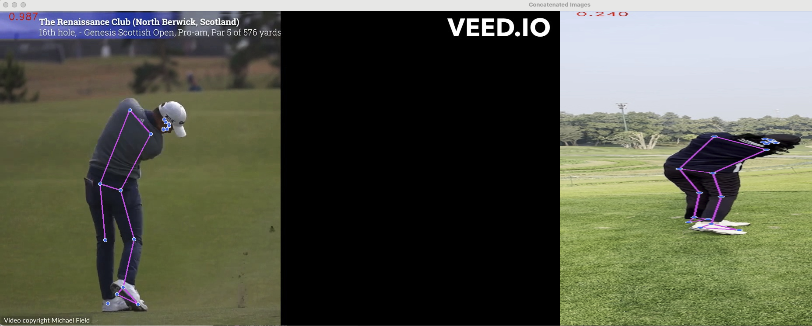

# GolfSwingAnalyzer
Compare your golf swing with PGA pros!

### iOS Demo
<p align="center">
  
</p>

## Details
The project is setup in two parts:
<ol>
  <li>Golf swing moments detection using the GolfDB trained neural network</li>
  <li>Using a custom KNN algorith to compare the 8 key moments in the swing</li>
</ol>

I scraped YouTube videos from the [Michael John Field](https://www.youtube.com/@MichaelJohnField) channel. He has a great collection of front-on and side-on golf swings of the popular PGA pros.

I currently only support the long-irons (5-iron and above), as getting the video, appropriately flagging it, cropping the video for our purposes, and generating the pose details is time consuming. But this project shows that given enough time to collect, clean, and parse data, a good comparision app can be made!

Once [GolfDB](https://github.com/wmcnally/golfdb) parses the video and generates 8 images for each moment in the swing, I used Google's Mediapipe library to analyze the image and generate pose data. The pose data, for 32 key body markers, is stored in a csv file for easy access.

The 8 golf swing moments:
<ol>
  <li>Address</li>
  <li>Toe-up</li>
  <li>Mid-backswing (arm parallel)</li>
  <li>Top</li>
  <li>Mid-downswing (arm parallel)</li>
  <li>Impact</li>
  <li>Mid-follow-through (shaft parallel)</li>
  <li>Finish</li>
</ol>

For the analysis and classification stage, we compare the pose data from input video's images with the pose data of the pros stored in the csv file. For each pro and for each moment, we calculate how "far away" the analogous input moment is. The closest distance is chosen as the classification.


Once the classification is made, the 8 key moments for the pro and the input video are displayed to the user:




### Demo:

[](PoseDetection/exampleOutput/golfcv_demo.mp4)


## To Run
You need a video file of your golf swing. Either from the front or side persepctives. For best perfomance with GolfDB event detection, the video should start a couple of seconds before the backswing starts.

Place the video file in the input folder.

The main function is in PoseDetection/src/analyzer.py.

To run the main, provide the path to the input video and the perspective.

For example:
```
python3 -m analyzer -i ../input/inputVideo -p Side
```

or 

```
python3 -m analyzer -i ../input/inputVideo -p Front
```

If there is an issue with the GolfDB submodule not being found, you may need to create a soft link:
```
ln -s ../../submodule/GolfDB GolfDB
```

## Local Pose Detection Test (iOS-consistent)
To test pose detection locally using the same Apple Vision method as the iOS app (same joints + confidence threshold), run:

```bash
swift Scripts/test_pose_detection.swift --video /path/to/swing.mp4
```

You can also test event-frame indices directly (Address..Finish order):

```bash
swift Scripts/test_pose_detection.swift --video /path/to/swing.mp4 --event-frames 12,33,50,60,72,80,95,120
```

Or test one image:

```bash
swift Scripts/test_pose_detection.swift --image /path/to/frame.jpg
```

Output JSON is written to `Scripts/output/local_pose_test.json` by default.

## Local PyTorch Event + Pose API (temporary iOS backend)
To run event detection and pose extraction from Python (instead of on-device CoreML/Vision), start the local API:

```bash
.venv/bin/python Scripts/event_detection_api.py --host 127.0.0.1 --port 8000
```

Health check:

```bash
curl http://127.0.0.1:8000/health
```

The iOS app is configured to call `http://127.0.0.1:8000/detect-events` first:
- If successful, it uses remote event frames and remote pose landmarks.
- If unavailable, it falls back to on-device CoreML event detection (and local Vision pose detection).

Notes:
- iOS Simulator: `127.0.0.1` works for a server running on your Mac.
- Physical iPhone: set the endpoint host in `GolfSwingAnalyzeriOS/GolfSwingAnalyzeriOS/Services/EventDetectionService.swift` to your Mac's LAN IP.

## TODO
<ul>
  <li>Resize input videos to a standard size, thus when comparing the pro landmarks and input landmarks, the ratio, distances, and angles should be more accurate</li>
  <li>Improve the front-end presentation</li>
  <li>Add more pro golfer swing data</li>
</ul>
